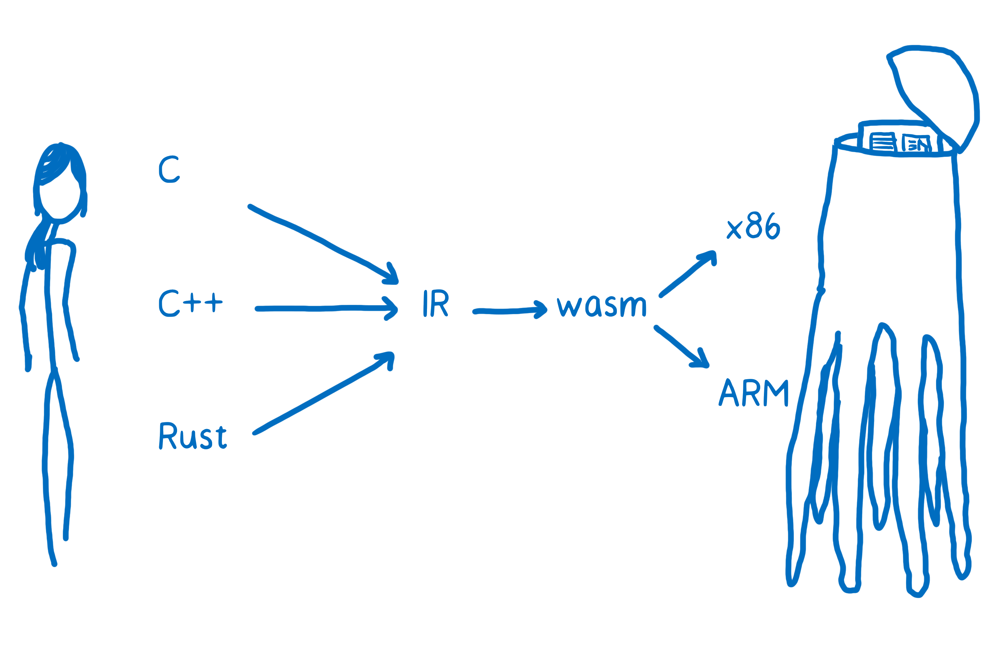
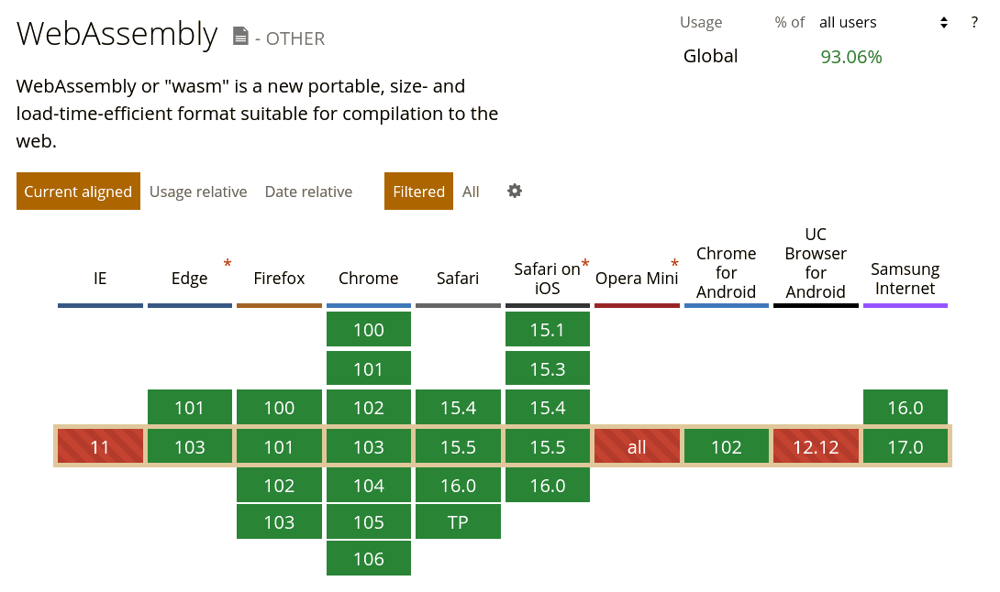
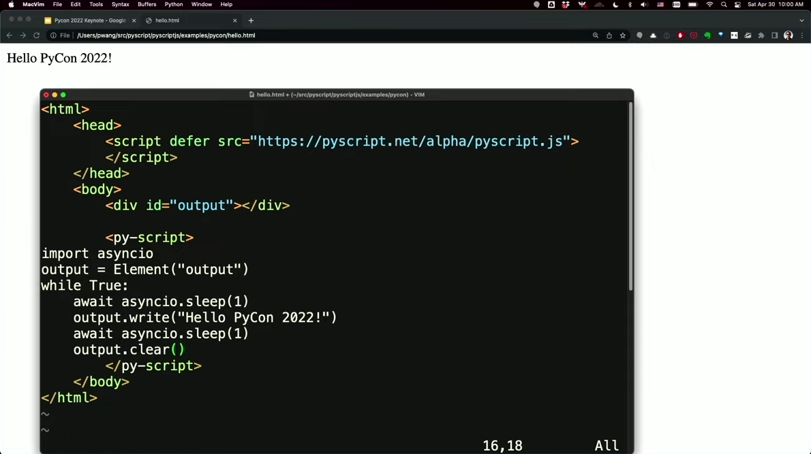
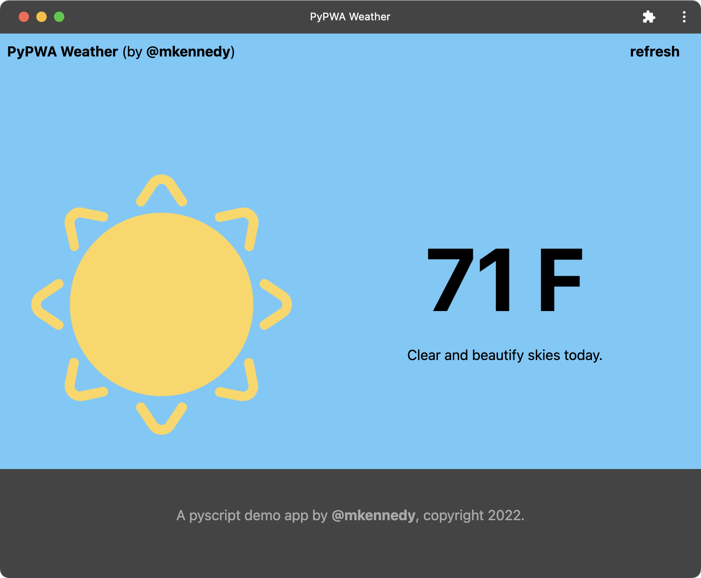

<style>
  section {
    background-color: #eee;
    background-position: bottom 0.3em left 1em;
    background-repeat: no-repeat;
    background-size: 10%;
    font: 24px sans-serif;
  }
  blockquote {
    border: 0;
    font-style: italic;
    line-height: 2em;
    padding: 1em;
  }
  code {
    background-color: #fff;
    font-family: monospace;
  }
  figcaption, figcaption a {
    color: #777;
    font-size: 0.5em;
  }
  h1 {
    color: #a00;
  }
  h1 strong {
    color: #a70;
  }
  img {
    background-color: transparent;
  }
  pre {
    background-color: #fff;
    border: 0;
  }
  ul {
    line-height: 2em;
  }
</style>

<style scoped>* { text-align: center }</style>

# Python in the browser

Mateusz Nowak

June 29 2022

---

Keep in mind that some slides were removed and that the presented information may be outdated.

&nbsp;

This slideshow was created with older version of Marp, so it doesn't look the same anymore.

---

# 🚫 We won't discuss these:

<!-- prettier-ignore -->
* cloud solutions (PythonAnywhere)
* web notebooks (Jupyter)
* Python-like programming languages (CoffeeScript)

---

# 🐍 What is Python?

<!-- prettier-ignore -->
* interpreted language, useful for rapid prototyping
* dynamic typing, but saner than vanilla JS
* multiple paradigms, context-aware keywords
* huge standard library, third-party repositories

---

# 🤔 Advantages

<!-- prettier-ignore -->
* unified FE/BE logic, such as forms validation
* faster and safer processing of user data
* reduced hosting costs (no application server)
* offline availability (WebView, PWA)

---

# 🚧 Problems

<!-- prettier-ignore -->
* Python interpreter not available out of the box
* native code of some libraries (C/C++/Rust)
* limited minification/bundling possibilities

---

<style scoped>figcaption { text-align: center }</style>

```
__all__='Field','CharField','IntegerField','DateField','TimeField','DateTimeField','DurationField',
class M:
 widget=AG;hidden_widget=A9;default_validators=[];default_error_messages={K:D('This field is require
 def __init__(A,*,required=H,widget=A,label=A,initial=A,help_text=L,error_messages=A,show_hidden_ini
  B=widget;A.required,A.label,A.initial=required,label,initial;A.show_hidden_initial=show_hidden_ini
  if E(B,type):B=B()
  else:B=W.deepcopy(B)
  A.localize=localize
  if A.localize:B.is_localized=H
  B.is_required=A.required;D=A.widget_attrs(B)
  if D:B.attrs.update(D)
  A.widget=B;C={}
  for F in reversed(A.__class__.__mro__):C.update(getattr(F,'default_error_messages',{}))
  C.update(error_messages or{});A.error_messages=C;A.validators=[*A.default_validators,*validators];
 def prepare_value(A,value):return value
 def to_python(A,value):return value
```

Minified Django code

---

# ⚙️ Use cases

<!-- prettier-ignore -->
* generic web applications
* data analysis and processing
* interactive code documentation
* browser plugins (?)
* ...

---


<style scoped>
* { text-align: center }
ul { display: grid; grid-template-columns: repeat(4, 1fr); list-style: none }
li { font-size: 1.25em; margin: 0.5em 0; }
</style>

# Implementations (just a few)

- Batavia
- **_Brython_**
- Empythoned
- Jiphy
- MicroPython
- Pyjamas
- **_Pyodide_**
- PyPyJS
- RapydScript
- RustPython
- Skulpt
- Transcrypt

---


<!-- prettier-ignore -->
* based on CPython with (almost) complete stdlib
* supports native code (to some extent)
* precompiled distribution and Docker build container available

---

<style scoped>* { text-align: center }</style>



hacks.mozilla.org/2017/02/creating-and-working-with-webassembly-modules

---

<style scoped>* { text-align: center }</style>



caniuse.com/wasm

---

# Pyodide example - external library

```js
loadPyodide().then(async (py) => {
  await py.loadPackage("mypackage");
  const mypackage = py.pyimport("mypackage");

  const result = mypackage.myfunction("test value");
});
```

---

# Pyodide example - React component

```python
import js
from pyodide import to_js

createElement = js.React.createElement
useEffect = js.React.useEffect
useState = js.React.useState

@to_js
def App(props, children):
    fact, set_fact = useState(None)

    @to_js
    async def fetch_cat_fact():
        response = await js.fetch("https://catfact.ninja/fact", method="GET")
        response_json = await response.json()
        set_fact(response_json.fact)

    useEffect(fetch_cat_fact, js.Array())

    return createElement('p', None, f"{fact}")
```

---

# Pyodide example - package management

```json
{
  "packages": {
    "libdemo": {
      "name": "libdemo",
      "version": "1.0.0",
      "file_name": "libdemo-0.1.0-py3-none-any.whl",
      "depends": ["pillow"]
    },
    "pillow": {
      "name": "Pillow",
      "version": "9.1.0",
      "file_name": "PIL-9.1.0-cp310-cp310-emscripten_wasm32.whl",
      "depends": []
    }
  }
}
```

---

# Pyodide drawbacks

<!-- prettier-ignore -->
* limited debugging features
* potential memory issues

---

<style scoped>* { text-align: center }</style>

# Is it worth it?

---

# Upcoming changes to Pyodide

<!-- prettier-ignore -->
* `import { loadPyodide } from "pyodide"`
* new packages: `opencv`, `ffmpeg`, `cryptography`
* integrity checks
* upstream CPython and Emscripten fixes

---

<style scoped>* { text-align: center }</style>

> CPython now has experimental support for cross compiling to WebAssembly
> platform `wasm32-emscripten`. The effort is inspired by previous work like
> Pyodide. (Contributed by Christian Heimes and Ethan Smith in bpo-40280.)

docs.python.org/3.11/whatsnew/3.11.html

---

<style scoped>* { text-align: center }</style>



_Programming for Everyone_, Peter Wang, PyCon US 2022

---

<style scoped>* { text-align: center }</style>



github.com/mikeckennedy/pyscript-pwa-example

---

<style scoped>* { text-align: center }</style>

> PyScript is a new framework for running Python code inside a browser. (...)
> PyCharm will recognize Python syntax for code inside <py-script> tags in html
> files and highlight it accordingly.

blog.jetbrains.com/pycharm/2022/06/2022-2-eap-2

---

<style scoped>* { text-align: center }</style>



---

# Online resources

Docs, examples, REPL:

- https://pyodide.org
- https://pyscript.net

Source code (dragons ahead):

- https://github.com/pyodide/pyodide/commits/main
- https://github.com/python/cpython/pulls?q=wasm

---

<style scoped>* { text-align: center }</style>

# Demo

---

<style scoped>* { text-align: center }</style>

# Thank you!
